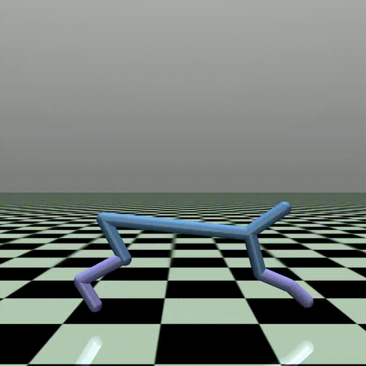
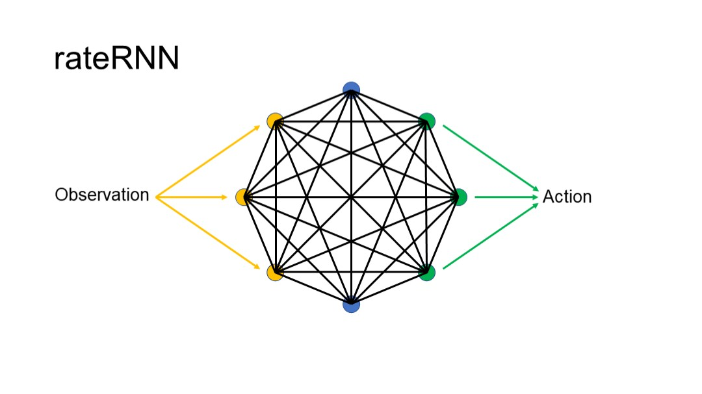

# rateRNN_Mujoco

- Tiny network
- Faster than most existing algorithms
- Work well on making periodic movement such as "Inverted Pendulum", "Swimmer", "Hopper", "Ant", "Half Cheetah" and "Walker2D". Work bad on controlling problems such as "Reacher", "Inverted Double Pendulum" and "Humanoid".
## Neuron model  
  

$$ \tau \dot{\boldsymbol{x}} = -\boldsymbol{x}+W\boldsymbol{r}+\mathrm{Input}$$  

$$ \boldsymbol{r} = \frac{1}{1+e^{-\boldsymbol{x}}}$$  

## Algorithm
for $g=1,2,...,G$ generations:  
&emsp; if $g==1$:  
&emsp;&emsp; $P^1 = \phi(Nparent)$ {initialize random weights in parants}  
&emsp; $C^g = P^g + noise$  
&emsp; $C^g_{Nchildren+1,...,Nchildren+Nparent} = P^g$  
&emsp;Evaluate $F_i = F(C^g_i)$  
&emsp;Sort $C^g_i$ with descending order by $F_i$  
&emsp;Set $P^{g+1}=C^g_{1,2,...,Nparent}$  

### Initialization:
Set a new environment $env$  
for $t=1,2,...,initiationLength$:  
&emsp; if $t==1$:  
&emsp;&emsp; Reset the environment $obs_1 = Reset(env)$  
&emsp; Choose a random action $act_t$  
&emsp; $obs_{t+1}=step(env,act_t)$

$obsMean = mean(obs)$  
$obsStd = std(obs)$  

### Evaluation function $F$:  
Set a new environment $env$  
Set new random network state $x$  
$totalReward=0$  
for $step=1,2,...,warmupSsteps$:  
&emsp; $\tau \dot{\boldsymbol{x}} = -\boldsymbol{x}+W\boldsymbol{r}+\mathrm{baselineInput}$  
&emsp; $\boldsymbol{r} = \frac{1}{1+e^{-\boldsymbol{x}}}$  
while not $done$:  
&emsp; if $t==1$:  
&emsp;&emsp; Reset the environment $obs_1 = Reset(env)$  
&emsp; for $step=1,2,...,updateSteps$:  
&emsp;&emsp; $\tau \dot{\boldsymbol{x}} = -\boldsymbol{x}+W\boldsymbol{r}+\mathrm{baselineInput} + \frac{obs_t-obsMean}{obsStd}$  
&emsp;&emsp; $\boldsymbol{r} = \frac{1}{1+e^{-\boldsymbol{x}}}$  
&emsp; $act_t=\psi(r)$  
&emsp; $obs_{t+1}, reward_t, done = step(env,action)$  
&emsp; $totalReward = totalReward+reward_t$  
return $totalReward$

## parameters
- Parameters can be set in `get_hyperparams.py`  

| Name | Value |
| ------ | ------ |
| $\tau$ | 0.01 |
| $baselineInput$ | 0.2 |
| $Nneuron$ | 30 |
| $Nparent$ | 16 |
| $Nchildren$ | 256 |
| $initiationLength$ | 100000 |
| $weightsClip$ | 5 |
| $warmupSteps$ | 100 |
| $updateSteps$ | 10 |

